***基于自己理解，很主观，口语性强，主要目的为了辅助理解，不是标准答案，而且我怀疑汪狱长没看过卷子，所以香农理论建议看看就好***

[TOC]
---
## 第一章
#### 1.1.1	信息安全的目标
(1)	机密性：不让其他人看（即使得到相关数据也不应该推断出来）
(2)	完整性：未经授权不许改（传输过程中篡改啊啥的也归这里）
(3)	认证性：知道是谁发的，确定中间没人往里面改
(4)	不可抵赖性：字面意思
(5)	可用性：随时随地提供服务，24小时无休了属于是😅
#### 1.1.2	攻击的主要形式和分类
攻击主要形式：
(1)	中断（拒绝服务，不让你发过去或者信息量过载）：可用性 
(2)	截取（主要是各种分析，这是被动，其他都是主动）：机密性
(3)	篡改：完整性
(4)	伪造：认证性
(5)	重放：感觉更多像是干扰会话，更多针对的是可用性
## 第二章
### 2.1 密码学分类
对称密码：加密密钥和解密密钥相同或者可以相互推导
非对称密码：一公钥一私钥
#### 2.1.3 保密体制模型：
就是明文、密文、加密密钥、算法、解密密钥、算法放在一起叫保密体制
#### 2.1.4 保密体制安全性:
(1) 唯密文（被动）：只有密文其他的啥都没有
(2) 已知明文（被动）：有明-密文对
(3) 选择明文（主动）：在（2）基础上，还能得到任何明文所对应的密文，简单来说可以加密明文（可以使用加密算法）
(4) 选择密文（主动）：简单来说可以解密密文（可以使用解密算法）
(5) 选择文本（主动）：选择明文+选择密文（无敌了属于是）
#### 2.1.6 认证体制的安全性（这里说要理解）
(1) 唯密钥：只知道公钥
(2) 已知消息：获得消息签名对
(3) 一般的选择消息：攻击者可以自己选择即将获得签名的消息，和签名者无关，当然了，当攻击者有密钥了这里就没意义了
(4) 特殊的选择消息：在知道公钥之后仍能自己选择即将获得签名的消息，但是是一次性的，和签名者有关
(5) 自适应的选择消息：已知公钥，让签名者对随便哪个消息都能签名
### 2.2 香农理论(重点)
- 自信息量：对应概率概率的对数的相反数：
$$I(x_i)= -\log_2 p(x_i)$$
大概是这样的一个公式，记住是概率对数*-1就好
- 信息熵：自信息量的加权（按概率）平均，表示**平均不确定性** $$H(x)=- \sum_{i=1}^np(x_i) \log_2p(x_i) $$大概是这样的一个数学定义，记不住就记文字定义，到时候直接写
- 条件熵：条件信息量的概率加权平均，就是说X在Y下的**平均不确定性**，表示收到变量Y后,对随机变量X仍然存在的不确定度。代表了在信道中损失的信息。（对于$H(X \lvert Y) $来说）$$H(X \lvert Y)= - \sum_{XY}p(xy) \log_2p(x\lvert y)$$
- 联合熵：就是联合事件自信息量的概率加权平均，就是说这联合事件XY的**平均不确定性** $$H(X , Y)= - \sum_{xy}p(x_iy_j) \log_2p(x_i y_j)$$
- 之间有些有趣的性质比如：
  1. $H(X , Y)= H(X)+H(Y \vert X)=H(Y)+H(X \vert Y)$
  2. $H(XY) \leq H(X) +H(Y)  $ X,Y要相互**独立**才行
这里我不理解，是要考数学？什么傻逼
- 互信息量：就是反映xy之间的关联性强弱的，在信息论里,是从Y获得的关于X的平均信息量。
$$ I(x_i;y_j) = \log_2 \frac{p(x_i\vert y_j) }{p(x_i)} $$
  1. 他是对称的，即$I(x_i;y_j) = I(y_j;x_i)$
  2. $I(x;y) \leq \min{I(x),I(y)}$
  3. 他的值是可正可负的，正则表明知道y有利于消除x的不确定性，反之则不利
   
- 条件互信息量：在随机事件$z_k$为条件下的互信息量
$$ I(x_i;y_j\vert z_k) = \log_2 \frac{p(x_i\vert y_jz_k) }{p(x_i \vert z_k)} $$
- 平均互信息量：就是X和Y的元素的互信息量，在Y上的概率加权平均（*注意这里它还不是熵嗷*）
$$I(X;Y)=\sum_{y\in Y}p(y_j)I(X;y_i)=\sum_{xy \in XY}p(x_iy_j)I(x_i;y_j)$$
  - 平均互信息和熵条件熵之间的关系
  $$I(X;Y)=H(X)-H(X\vert Y)=H(Y)-H(Y \vert X)$$
## 第三章
### 3.1 置换密码
就是明文的重新排列
### 3.2 代换密码
就是明文中的字符替换成其他字符
#### 3.2.1 单表代换
##### 凯撒密码
$$c \equiv m+k \ mod \ 26$$
这个没啥好说的
##### 乘法密码
$$c \equiv m*k\ mod \  26$$
同样很简单没啥好说的
##### 仿射密码（在数学上我们称之为affine的，实际上就是线性的，这个东西看外国的数学教学就会很熟悉，但实际上就是线性）
$$c\equiv k_1*m + k_2\ mod \ 26 $$
#### 3.2.2 多表代换密码
相比单表一个字母对应一个字母，多表代换可以使多个字母同时对应一个字母
##### playfair密码
预先规定I和J相等。将明文分成两个一组（奇数则在末尾添加事先约定好的字母，分组有字母相同的项，则在两字母之间插入一个事先约定好的字母），替换基于一个5*5的字母矩阵（先按顺序写入密钥，若有重复字母，则在第二次遇到时跳过那个字母，之后将字母表中剩下的按字母顺序依次填入矩阵中，**注意这里的矩阵是一个循环环，即在第一列的左边是第五列，第一行的上面是第五行**）。看字母组$p_1,p_2$在矩阵中的位置进行替换
  (1) 若$p_1,p_2$在同一行，则换成向右平移两格的
  (2) 若$p_1,p_2$在同一列，则换成向下平移两格的
  (3) （1）、（2）都不满足，则找以$p_1,p_2$为对角顶点，变换成同行的另外顶点
例如当密钥是ISCBUPT时密钥矩阵为：

<table><tbody>
    <tr>
        <td>I/J</td><td>S</td><td>C</td><td>B</td><td>U</td>
    </tr>
    <tr>
        <td>P</td><td>T</td><td>A</td><td>D</td><td>E</td>
    </tr>
    <tr>
        <td>F</td><td>G</td><td>H</td><td>K</td><td>L</td>
    </tr>
    <tr>
        <td>M</td><td>N</td><td>O</td><td>Q</td><td>R</td>
    </tr>
    <tr>
        <td>V</td><td>W</td><td>X</td><td>Y</td><td>Z</td>
    </tr>
</table>

##### 弗吉尼亚密码
书上说的太麻烦了，简单来说就是按位置变k的凯撒密码,k是密钥字母(key_i)模26后的余数$$k_i \equiv key_j \ mod\ 26 $$ $$i \equiv j \  mod\ keylength $$ keylength就是密钥长度，i指第i个明文字母，j指第j个密钥字母
加密公式为（解密就变减）$$c_i \equiv m_i+k_i \  mod \ 26$$
##### 希尔密码
很简单，矩阵乘除，将明文分成可以和密钥矩阵相乘的就行$$C \equiv K*M \ mod\ 26$$解密时求K的逆就行（注意求逆时要取模）
### 3.2古典密码破解
#### 破解弗吉尼亚（这个地方看一遍懂了就好，这玩意儿可不兴背啊😂）
对于破解弗吉尼亚密码这样的多表密码，重要的就是找到**密钥长度**：
##### 找到密钥长度：
1. kasiki法
找密文中相同的字母组，求相同字母组距离的**最大公因数**，这个挺简单的。

    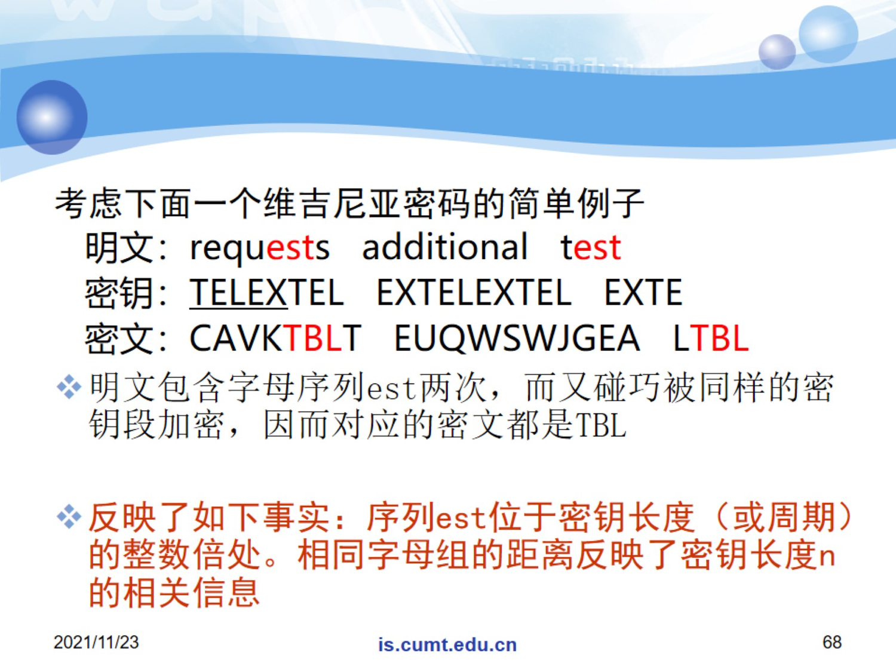

1. 重合指数法
记长度为n的字母串中两个字母相同的**概率**为重合指数$I_c(x)=\frac{\sum_{i=0}^{25}f_i(f_i-1)}{n(n-1)}$ $f_i$是第$i$个字母再密文中出现的频率，$n$为密文长度
经过统计可知正常的重合指数期望是0.065（单表密码算出来的就是0.065），就是说当你找到对的密钥长度，并把密文分成对应的组的时候，算出来的重合指数就应该是0.065
##### 确定密钥
- 重合互指数法：记x,y为两串字母串，长度为n和n'。重合互指数指x随机一个元素等于y的一个随机元素的概率$MI_c(x,y)= \frac{\sum_{i=0}^{25}f_if'_i}{nn'}$这个可以帮助我们找到密钥字母之间的位置差，因为当两个密文组的位移相同时（即加密他们的字母相同时），重合指数应是0.065。

因为我们已经知道**密钥长度为d**，现在只需要把密文是什么求出来。所以把密文按相隔d为一组，分为d组，分别为$Y_1,Y_2,……,Y_d$，这时，每个$Y_i$就是一个凯撒密码加密的结果，取其中两组为$Y_i,Y_j$，对应加密他们的密钥字母为$k_i,k_j$，将其中一组的每个字母序后移位（类似于a向后移一位变成b这样），计算其重合互指数，直至为0.065为止，此时说明此时他们相对于明文的位移相等。假设向后移位了c次，则可以认为密钥中$k_i-k_j = c$这样把所有组合都算一遍，讲道理是可以得到一个方程组，化简后应该是能够用一个字母就能表示完其他的所有的字母的。把这个字母从a-z都试一次，代入到其他字母中，就能找到密钥了。
#### 破解希尔密码
得到明密文对，按照m写成矩阵，求逆乘起来就好嘛
因为$$C \equiv K*M \ mod\ 26$$ 所以要求密钥只需要求M的逆然后乘过去就行 $$K \equiv C*M^{-1} \ mod\ 26$$就这
### 第四章 分组密码
狱长说这里考的是流程图，以及每步的作用是什么
#### DES（面向bit）
##### 流程图
加密过程（这个得背下来吧）

    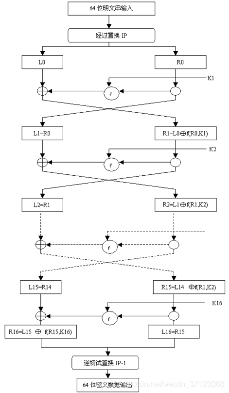

##### 每步的作用
- 初始IP置换：没有密码意义，单纯历史遗留
- F函数：其内部有E扩展、S、P盒变换
  - E扩展：将32位输入扩展为48位输出，改变了位的次序，主要用途是使送入的数据长度能和子密钥长度相同，便于异或运算
  - S盒：将48位数据分成8个子块，每块都与$s_i$盒进行运算（运算方法是以$b_1b_6$为行$b_2b_3b_4b_5$为列，查表即可）。进行非线性代换，是DES中唯一非线性的部分，让48位重归32位
  - P盒：简单的单位置置换

    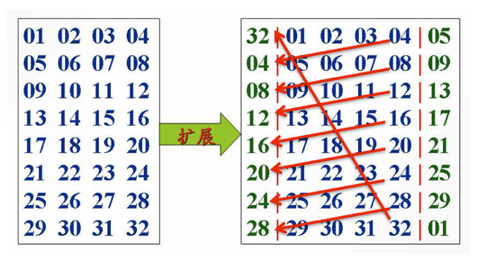
     
    
E盒扩展示意

##### 安全性
- DES存在一些**弱密钥和半弱密钥**（但是在总密钥中占比小，对安全性威胁小）
  - 弱密钥（实际上只有00000000 00000000、00000000 FFFFFFFF、FFFFFFFF 00000000、FFFFFFFFF FFFFFFFF这四个）指在初始密钥生成子密钥时，生成的各个子密钥都相同，这就使加密和解密运算相同，得到的结果都是明文
  - 半弱密钥则是虽然密钥不同，但是他们加密统一明文得到的结果相同
- DES的56位密钥无法抵挡**穷举攻击**
- 互补性：再DES算法中，若输入的明文和密钥同时取补，则**E和子密钥产生器输出也都取补**，因此经过异或运算后输出的和原先什么都没做直接拿明文密钥加密的结果是一样的。进入S盒的数据没变，所以输出也和原先一样。这就让得到明文的补的密文变得很简单（直接用密钥的补计算明文的补就好）。这样就使得**选择明文攻击**变得简单，因为当进行穷举时，先算出来$c_1=E_k(m), \bar{c_2} =E_{k}(\bar m)= E_{\bar{k}}(m)$，我们只需要算一次加密值，若为期望的密文则密钥就是这个，若是$\bar{c}_2$则是密钥的补。这样就让运算量直接**减半**。
- 迭代轮数少时差分攻击很好（8轮），16轮则穷举攻击效果好（这个ppt上没提，但是是从迭代轮数角度看的）
##### 这里其实还有个子密钥生成，但汪狱长没说，现挖坑感觉不像是重点的样子，后面再填
#### AES（面向byte）
##### 流程图
AES是按列分组的

    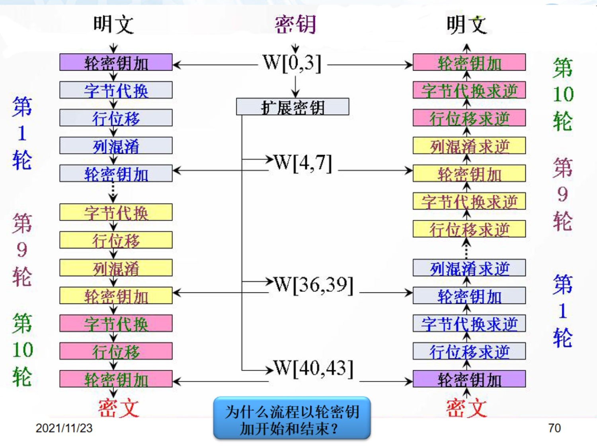

##### 每步的作用
- 字节代换：这里是用S盒查表（一字节高四位为行，低4位为列），**非线性变换，能有效地抵挡各种密码分析**
- 行移位：向左循环移位，按行数决定移位字节数，这一步确保了**某列的四个字节被扩展到了不同的列**
- 列混淆：通过矩阵相乘得到的。这一步基于*最大距离线性码*设计，拥有较好的**扩散性**，经过足够多的行列变换后，是的输出的所有位均与输入位有关。而且其变换系数基于算法执行效率提供的，使**加密效率提高**
- 轮密钥加：能影响数组中的每一位
##### 安全性分析
- 弱密钥：设计上不对称，避免了弱密钥
- 差分分析和线性分析：有较好的抗击打能力
- 密钥穷举：$2^{127}$种可能，计算量大
#### 分组密码工作模式
##### 电子密码本ECB

    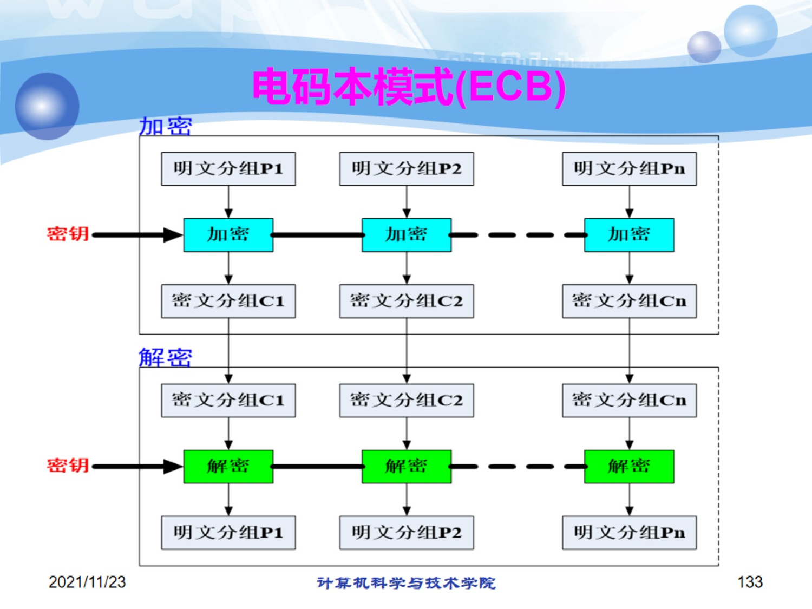

特点：
1. 操作简单
2. 明文重复内容在密文中重复出现易受**统计分析攻击、代换攻击和分组重放攻击**
3. 链接依赖性：各组加密相互**独立**，可**并行处理**
4. 密文分组内的错误只会影响自己的解密
##### 密码分组链接模式（CBC）

    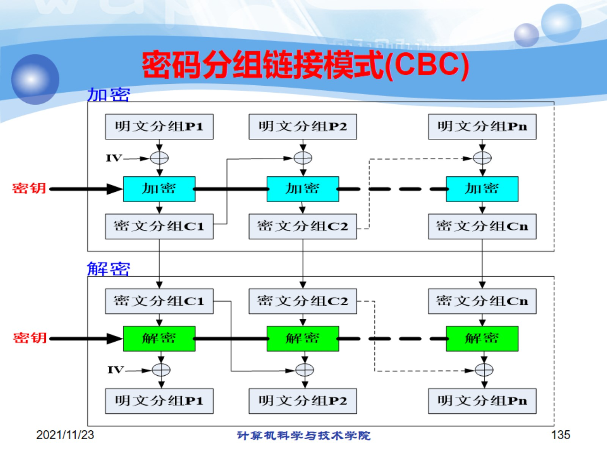

特点：
1. 反馈机制：密文依赖前面的明文分组
2. 链接依赖性：前面密文分组解密正确与否影响后面的解密，**无法并行处理**
3. 错误传播：密文分组内的错误会影响自己和后面一组，错误传播为两组 
4. 初始化向量IV不需保密
##### CFB

    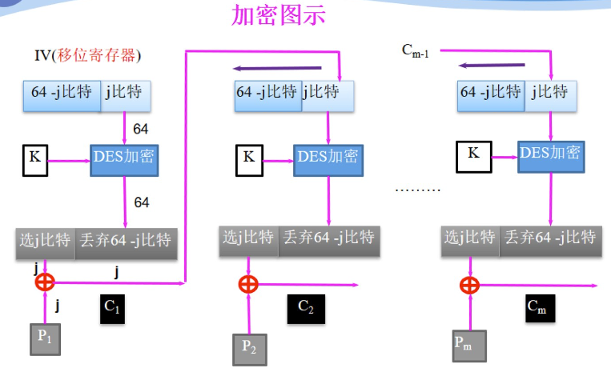

    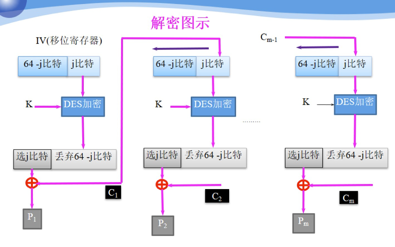

优点：
自同步能力强，可处理任意长度消息
缺点：
1. 明文某一分组有错，后面全寄，但是解密也只有有错的那一组是错的，其他完好无损
2. 密文里一位错误会引起明文的一个单独错误，此错误在离开移位寄存器之前，都会使加密出现错误（如8比特CFb中，密文中1bit错误会使后续解密的明文产生9bit错误，1bit是自身，而剩下8bit就是这个错误在移位寄存器循环8次至移出所产生的）
##### OFB
注意这里反馈过去的是**移位结果**，而不是生成的密文组

    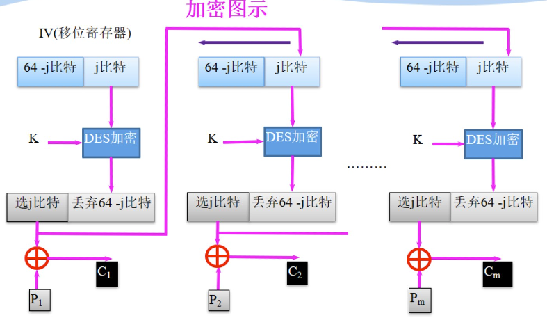

    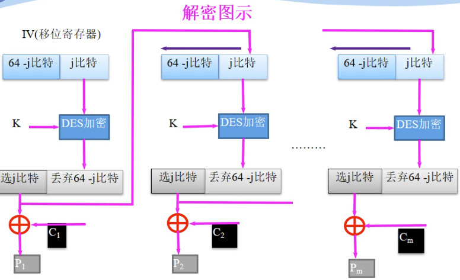

优点：没有错误传播
缺点：
1. 失去**同步**直接寄
2. 抗消息流错改能力弱
##### CTR

    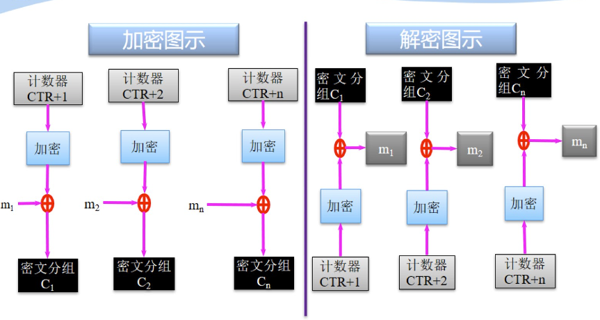

特点：
1. 随机密文特性：密文分组处理相互独立
2. 高效率：可**并行**处理，贼快
3. 可处理任意长度的数据，且不用设计解密算法
### 第五章 序列密码
#### LFSR
- 要求根据示意图写输出
例：101对应的，是$p(x)=x^3+x^1+1$大概是这样，求周期如果是本原多项式则是$2^n-1$，如果不是，就从头推到尾，来看周期
- m序列：只有当特征多项式为本原多项式时，才能算作m序列
本原多项式：（1）首先不可再因式分解；（2）可整除$x^p+1，p=2^n-1$,n为级数（就最高项的系数）；（3）不可整除$x^q+1, q<p$（盲猜这里出计算题）
https://blog.csdn.net/weixin_45015947/article/details/89891757

但这里破解上课做过作业，没说是重点，下面这个方法看看就行（a是密钥流，c是我们要求的多项式系数）

    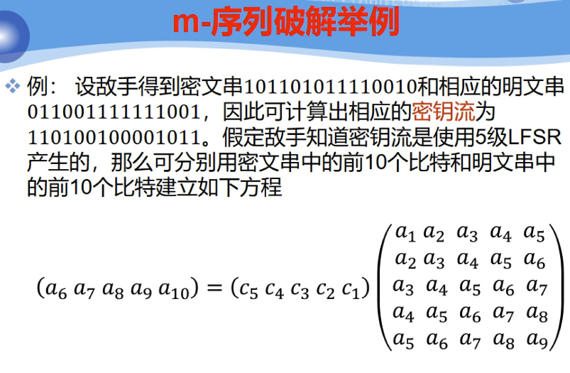

### 第六章 Hash函数
本质是基于单向函数、不可逆
hash有个重要的性质叫做**抗碰撞性**
- 抗弱碰撞性：对任意给定的消息m，找到另一个m'使$H(m)=H(m')$是计算上不可行的
- 抗强碰撞性：对任意m和m'，$H(m)=H(m')$是计算上不可行的
- 简单来说抗强碰撞性包含抗弱碰撞性，是抗弱碰撞性的加强版

狱长说要清楚MD5和SHA1模型，具体算法不需要记，所以看看就行了
#### MD5
记住这里有个有趣的东西叫大小端转换，计算前对初始变量进行一次，结束之后再进行一次就好
例：0x01234567大小端转换之后是0x67452301
\
先分组（512分成16组），在对每组进行四轮运算，每轮运算16步

    

    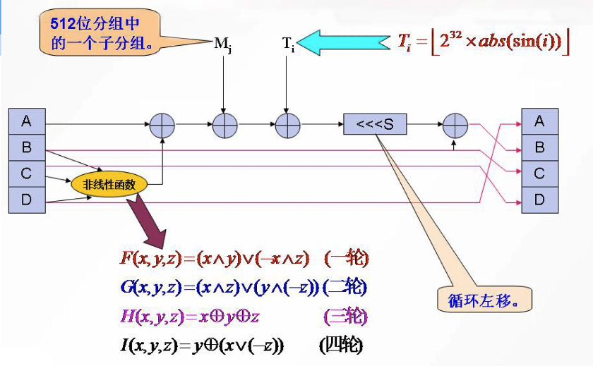

##### 生日攻击（这里留个坑，但是我感觉学了概率论，这里也不会有啥问题，嗯算就完事了）
#### SHA1
这里要填充一个1和若干个0令消息长度模512余-64，之后再消息后附加64bit的无符号整数，其值为原始消息长度。

    

    

    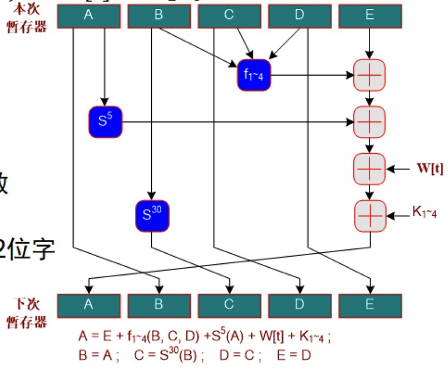

#### 消息认证码的作用
1. 可以用来确定消息是否被篡改
2. 确定消息是否来自真正的发送方
### 第七章 公钥密码体制
这俩算法流程要清楚，并且要能对其安全性进行分析
#### RSA
##### 流程
1. 选两个大素数$p,q$，计算$n=pq,\varphi(n)=(p-1)(q-1)$
2. 随机选一个e，使$gcd(e,\varphi(n))=1$，将e作公钥
3. 计算$d \equiv e^{-1} \ (mod\ \varphi(n))$，d作为私钥
###### 加密
1. 接收公钥（e,n）
2. 把消息分组成为长度为L（$L<\log_2n$）的消息分组$M=m_1m_2...m_t$
3. 加密算法$c_i\equiv m_i^e\ (mod\ n)$
解密就是$m_i\equiv c_i^d \ (mod\ n)$

##### 安全性
1. p,q保密，同时要保证两数相差大。
因为当两数相差很小时可列出方程组$$\begin{cases}
p-q=k\\
p+q=\sqrt{k^2+4n}\\
\end{cases}$$
依次试k很快就能求出p和q了

2. 同时保证（p-1）和（q-1）的因数中要有大的素因子（为了防御循环攻击）
循环攻击成立的条件是找到一个t使$m^{e^t}\equiv m$，即$m^{e^t-1}\equiv 1\ (mod\ n)$。设m在模n下的指数为k，即$
m^k\equiv 1\ (mod\ n),\ k\ |\varphi(n)$。那么对于k有$k \  \vert (e^t-1)$，即$e^t\equiv 1\ (mod\ k)$。又当k和e互素时，$t\ |\varphi(k)$，我们希望t尽量大，这样攻击者就需要循环很久才能试出来t，所以k就要尽量大。又因为$k\ |\varphi(n)$所以，p-1）和（q-1）的因数要有大的素因子

RSA的安全性是基于大数分解问题的

#### ElGamal
基于离散对数问题
##### 流程
取大数$p,q$,随机取一x，计算$y\equiv g^x\ mod \  p$，y、p、g为公钥
###### 加密
先把明文分成长度为L（$L<\log_2p$）的消息分组$M=m_1m_2...m_t$
对每个消息分组：
1. 选择随机整数$r_i,(1<r_i<p-1)$
2. 计算$c_i \equiv g^{r_i},c_i' \equiv m_iy^{r_i} \ (mod\ p)$
###### 解密
对每个组计算$m_i\equiv(c_i'/c_i^x)\ (mod\ p)$
##### 江江哥PPT上没安全性，复习只取交集，暂时不看
### 数字签名
RSA和ElGamal和其安全性能的分析

保证信息的完整性、认证性和不可否认性
#### RSA数字签名
##### 流程
1. 密钥生成与RSA同
2. 签名算法
要用hash函数产生消息摘要（因为产生的摘要长度是固定的，所以只用消息摘要加密的话速度会快很多，而且能避免同态攻击书P223），用消息摘要进行RSA加密，得到签名
3. 验证算法
收到消息和签名后，先计算消息摘要，然后检验签名RSA解密和摘要一致不一致
##### 安全性
依靠安全的Hash函数，可以保证RSA不受伪造签名、利用已有签名和利用签名获得明文的攻击（这里也提醒我们不要随便地给陌生人签名）
除此之外，还会有签名重用的问题，因为算法固定，如果要重发一个消息，他的签名也不会变，这里的建议是加入不同的随机数
#### ElGamal签名体制
##### 流程
1. 密钥生成与ElGamal相同
2. 消息为m，选择随机数k，计算：$$r\equiv g^k\ (mod\ p)\\
s\equiv[h(m)-xr]k^{-1}\ (mod\ p-1)$$签名为r和s
3. 验证：$y^rr^s\equiv g^{h(m)}\ (mod\ p)$
##### 安全性
1. 非确定性数字签名算法，同一消息的签名会因随机数k的不同而不同
2. 安全性基于有限域上计算离散对数的困难性
3. 随机数k不能泄露（若泄露则可通过s计算出x，私钥泄露直接寄）
4. 随机数k也不能重复利用（若重复，会出现相同的r对应不同的s，通过两个s之差求逆乘在代入运算是可以求出k的值的）
5. 多次签名所选的k之间不能有关联，（要不然能通过连立方程组的方式将x求出）、
6. hash函数保护之免受攻击
因为

    

